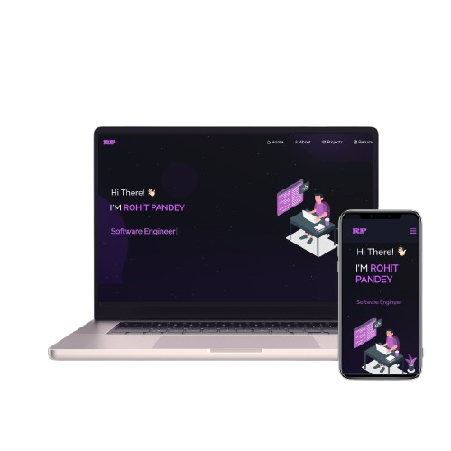

# 💼 Rohit Pandey - Portfolio Website

<div align="center">
  
</div>

<h2 align="center">
  🚀 Personal Portfolio Website<br/>
  <a href="https://rohit-pandey-website.netlify.app/" target="_blank">Live Demo</a>
</h2>

<div align="center">

[](https://forthebadge.com) &nbsp;
[](https://forthebadge.com) &nbsp;
[](https://forthebadge.com) &nbsp;

</div>

## 👨‍💻 About

Hi There! 👋 I'm **Rohit Pandey**, a passionate **Software Engineer** who loves creating innovative web applications and solving complex problems through code.

This is my personal portfolio website showcasing my projects, skills, and professional journey in software development.

## 🛠️ Built With

This portfolio was built using modern web technologies:

- **React.js** - Frontend framework
- **JavaScript** - Programming language
- **HTML5 & CSS3** - Markup and styling
- **React Bootstrap** - UI components
- **React Router** - Navigation
- **React Icons** - Icon library
- **Netlify** - Deployment platform

## 🎯 Features

- **📱 Fully Responsive** - Works perfectly on all devices
- **🎨 Modern Design** - Clean and professional UI with purple theme
- **⚡ Fast Loading** - Optimized performance
- **🧭 Easy Navigation** - Smooth single-page application
- **📊 Interactive Elements** - Engaging user experience
- **📄 Resume Integration** - Downloadable resume section

## 🚀 Tech Stack Showcase

- **Frontend**: React, JavaScript, TypeScript, HTML5, CSS3
- **State Management**: Redux
- **Backend**: Node.js
- **Database**: MongoDB, Firebase
- **Testing**: Jest
- **Tools**: Git, CI/CD
- **Mobile**: React Native
- **Problem Solving** - Analytical thinking and debugging

## 📂 Project Structure

```
src/
├── components/
│   ├── About/          # About section with skills
│   ├── Home/           # Landing page
│   ├── Projects/       # Project showcase
│   ├── Resume/         # Resume section
│   └── Navbar.js       # Navigation component
├── Assets/             # Images and documents
└── style.css          # Global styles
```

## 🛠 Installation and Setup

1. **Clone the repository**

   ```bash
   git clone https://github.com/pandeyrohit1410/rohit-pandey-portfolio.git
   ```

2. **Navigate to project directory**

   ```bash
   cd rohit-pandey-portfolio
   ```

3. **Install dependencies**

   ```bash
   npm install
   ```

4. **Start development server**

   ```bash
   npm start
   ```

5. **Open your browser**
   ```
   http://localhost:3000
   ```

## 🚀 Deployment

The website is deployed on Netlify and automatically updates with new commits.

**Live URL**: [https://rohit-pandey-website.netlify.app/](https://rohit-pandey-website.netlify.app/)

## 📱 Sections

- **🏠 Home** - Introduction and welcome message
- **👨‍💻 About** - Professional background and technical skills
- **💼 Projects** - Showcase of development projects
- **📄 Resume** - Downloadable resume and experience

## 🤝 Connect With Me

- **GitHub**: [@pandeyrohit1410](https://github.com/pandeyrohit1410)
- **LinkedIn**: [Rohit Pandey](https://www.linkedin.com/in/rohit-pandey-95a742236/)
- **Email**: pandeyrohit1410@gmail.com

## 🙏 Acknowledgments

- Built with modern React.js and best practices
- Icons from [React Icons](https://react-icons.github.io/react-icons/)
- Deployed with [Netlify](https://netlify.com)

---

<div align="center">
  <p>Made with ❤️ by Rohit Pandey</p>
  <p>⭐ Star this repo if you like it!</p>
</div>
